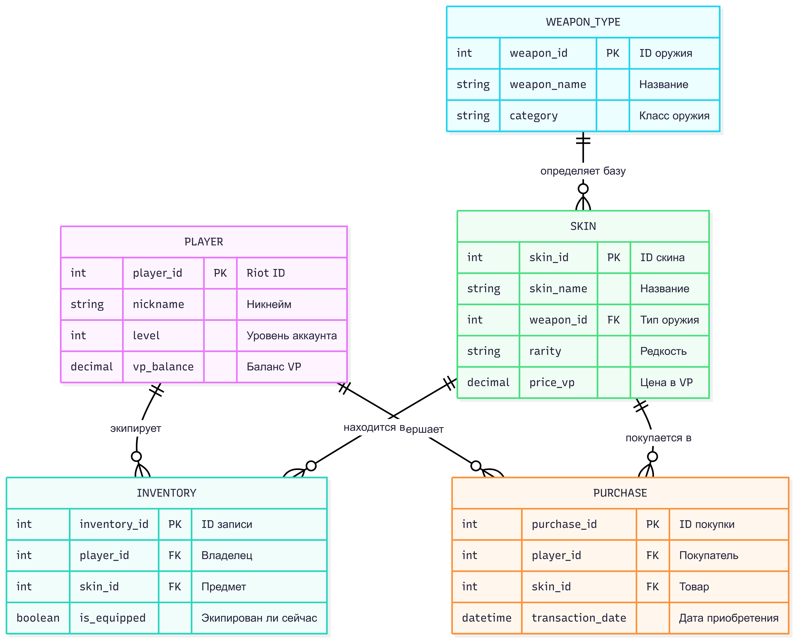

# Система управления экосистемой Valorant

Бэкенд-приложение для управления игроками, скинами, типами оружия и внутриигровыми транзакциями.

## 1. Требования к хранимым данным

Система управляет следующими ключевыми сущностями:
* **Player**: Хранит уникальные данные: никнейм, уровень и VP.
* **Weapon Type**: Определяет категории доступного в игре оружия.
* **Skin**: Косметические предметы с определенной редкостью и ценой, привязанные к типу оружия.
* **Inventory**: Отслеживает владение скинами конкретными игроками.
* **Purchase**: Регистрирует историю транзакций.

**Пример сущности:**
```java
@Entity
@Table(name = "INVENTORY")
@Getter
@Setter
@NoArgsConstructor
@AllArgsConstructor
public class Inventory {
    @Id
    @GeneratedValue(strategy = GenerationType.IDENTITY)
    @Column(name = "inventory_id")
    private Integer id;

    @ManyToOne
    @JoinColumn(name = "player_id", nullable = false)
    private Player player;

    @ManyToOne
    @JoinColumn(name = "skin_id", nullable = false)
    private Skin skin;

    @Column(name = "is_equipped")
    private Boolean isEquipped = false;
}
```

**Основные ограничения:**
- Никнейм игрока должен быть уникальным и не может быть пустым.
- Баланс VP не может быть отрицательным.
- Каждый скин обязан иметь привязку к существующему типу оружия.

**Ограничения:**
```sql
CREATE TABLE WEAPON_TYPE (
    weapon_id SERIAL PRIMARY KEY,
    weapon_name VARCHAR(50) NOT NULL,
    category VARCHAR(50)
);

CREATE TABLE PLAYER (
    player_id SERIAL PRIMARY KEY,
    nickname VARCHAR(50) NOT NULL UNIQUE,
    level INT DEFAULT 1,
    vp_balance DECIMAL(15, 2) DEFAULT 0 CHECK (vp_balance >= 0)
);

CREATE TABLE SKIN (
    skin_id SERIAL PRIMARY KEY,
    skin_name VARCHAR(100) NOT NULL,
    weapon_id INT NOT NULL,
    rarity VARCHAR(30),
    price_vp DECIMAL(10, 2),
    FOREIGN KEY (weapon_id) REFERENCES WEAPON_TYPE(weapon_id)
);

CREATE TABLE INVENTORY (
    inventory_id SERIAL PRIMARY KEY,
    player_id INT NOT NULL,
    skin_id INT NOT NULL,
    is_equipped BOOLEAN DEFAULT FALSE,
    FOREIGN KEY (player_id) REFERENCES PLAYER(player_id),
    FOREIGN KEY (skin_id) REFERENCES SKIN(skin_id)
);

CREATE TABLE PURCHASE (
    purchase_id SERIAL PRIMARY KEY,
    player_id INT NOT NULL,
    skin_id INT NOT NULL,
    transaction_date TIMESTAMP DEFAULT CURRENT_TIMESTAMP,
    FOREIGN KEY (player_id) REFERENCES PLAYER(player_id),
    FOREIGN KEY (skin_id) REFERENCES SKIN(skin_id)
);
```

## 2. Проектирование структуры БД

### ER-диаграмма


### Анализ нормализации (Соответствие форме Бойса-Кодда)
База данных спроектирована таким образом, чтобы удовлетворять требованиям **Нормальной формы Бойса-Кодда (BCNF)**.

**Обоснование:**
1. **Таблица Player**: Единственным детерминантом является `player_id` (первичный ключ). Все функциональные зависимости имеют вид $Ключ \to Атрибут$. Нарушений BCNF не обнаружено.
2. **Таблица Skin**: Детерминантом является `skin_id`. Атрибуты (`skin_name`, `rarity`, `price_vp`) зависят только от первичного ключа. Связь с типом оружия реализована через внешний ключ, что является стандартным механизмом реляционной модели и не нарушает BCNF.
3. **Таблица WeaponType**: Детерминантом является `weapon_type_id`. Все атрибуты (`weapon_name`, `category`) полностью функционально зависят от этого ключа.

Поскольку в каждой таблице любой детерминант является суперключом, схема БД находится в **форме Бойса-Кодда**.

## 3. Архитектура приложения

Приложение построено на основе многослойной архитектуры:
* **Слой контроллеров**: Обработка HTTP-запросов и формирование RESTful ответов.
* **Слой сервисов**: Реализация бизнес-логики, правил валидации и управление транзакциями.
* **Слой репозиториев**: Абстракция доступа к данным с использованием Spring Data JPA.
* **Слой моделей**: Описание сущностей базы данных.

### Как пример рассмотрим каждый слой для сущности Purchase:
#### Model:
```java
@Entity
@Table(name = "PURCHASE")
@Getter
@Setter
@NoArgsConstructor
@AllArgsConstructor
public class Purchase {
    @Id
    @GeneratedValue(strategy = GenerationType.IDENTITY)
    @Column(name = "purchase_id")
    private Integer id;

    @ManyToOne
    @JoinColumn(name = "player_id", nullable = false)
    private Player player;

    @ManyToOne
    @JoinColumn(name = "skin_id", nullable = false)
    private Skin skin;

    @Column(name = "transaction_date")
    private LocalDateTime transactionDate = LocalDateTime.now();
}
```
#### Repository:
```java
@Repository
public interface PurchaseRepository extends JpaRepository<Purchase, Integer> {
}
```
#### Service:
```java
@Service
public class PurchaseService {

    private final PurchaseRepository purchaseRepository;

    public PurchaseService(PurchaseRepository purchaseRepository) {
        this.purchaseRepository = purchaseRepository;
    }

    public List<Purchase> getAllPurchases() {
        return purchaseRepository.findAll();
    }

    public Optional<Purchase> getPurchaseById(Integer id) {
        return purchaseRepository.findById(id);
    }

    public Purchase createPurchase(Purchase purchase) {
        return purchaseRepository.save(purchase);
    }

    public Purchase updatePurchase(Integer id, Purchase purchaseDetails) {
        Purchase purchase = purchaseRepository.findById(id)
                .orElseThrow(() -> new RuntimeException("Purchase not found"));

        if (purchaseDetails.getPlayer() != null) {
            purchase.setPlayer(purchaseDetails.getPlayer());
        }
        if (purchaseDetails.getSkin() != null) {
            purchase.setSkin(purchaseDetails.getSkin());
        }
        purchase.setTransactionDate(purchaseDetails.getTransactionDate());

        return purchaseRepository.save(purchase);
    }

    public void deletePurchase(Integer id) {
        purchaseRepository.deleteById(id);
    }
}
```
#### Controller:
```java
@RestController
@RequestMapping("/api/purchases")
@RequiredArgsConstructor
public class PurchaseController {

    private final PurchaseService purchaseService;

    @GetMapping
    public List<Purchase> getAllPurchases() {
        return purchaseService.getAllPurchases();
    }

    @GetMapping("/{id}")
    public ResponseEntity<Purchase> getPurchaseById(@PathVariable Integer id) {
        return purchaseService.getPurchaseById(id)
                .map(ResponseEntity::ok)
                .orElseGet(() -> ResponseEntity.notFound().build());
    }

    @PostMapping
    public ResponseEntity<Purchase> createPurchase(@RequestBody Purchase purchase) {
        return ResponseEntity.ok(purchaseService.createPurchase(purchase));
    }

    @PutMapping("/{id}")
    public ResponseEntity<Purchase> updatePurchase(@PathVariable Integer id, @RequestBody Purchase purchase) {
        try {
            return ResponseEntity.ok(purchaseService.updatePurchase(id, purchase));
        } catch (RuntimeException e) {
            return ResponseEntity.notFound().build();
        }
    }

    @DeleteMapping("/{id}")
    public ResponseEntity<Void> deletePurchase(@PathVariable Integer id) {
        purchaseService.deletePurchase(id);
        return ResponseEntity.noContent().build();
    }
}
```

**Технологический стек:**
- Java 21
- Spring Boot 3.4.5
- PostgreSQL
- Hibernate (JPA)
- Maven

## 4. Тестирование

Для проверки работоспособности эндпоинтов используются автоматизированные интеграционные тесты:
* **JUnit 5**: Фреймворк для запуска тестов.
* **MockMvc**: Инструмент для имитации HTTP-запросов и проверки ответов API без полного развертывания сервера.

**Покрытые сценарии:**
- Успешные операции CRUD (создание, чтение, обновление, удаление).
- Обработка ошибок (например, возврат 404 Not Found при поиске несуществующего игрока).
- Валидация бизнес-логики (например, отказ в покупке при недостаточном балансе).

**Пример тестов для сущности Purchase:**
```java
@SpringBootTest
@AutoConfigureMockMvc
@ActiveProfiles("test")
@Transactional
public class PurchaseControllerTest {

    @Autowired
    private MockMvc mockMvc;

    @Autowired
    private PurchaseService purchaseService;

    @Autowired
    private PlayerService playerService;

    @Autowired
    private SkinService skinService;

    @Autowired
    private WeaponTypeService weaponTypeService;

    @Autowired
    private ObjectMapper objectMapper;

    private Player testPlayer;
    private Skin testSkin;

    @BeforeEach
    void setUp() {
        WeaponType weaponType = new WeaponType();
        weaponType.setWeaponName("Vandal");
        weaponType.setCategory("Rifle");
        weaponType = weaponTypeService.createWeaponType(weaponType);

        testSkin = new Skin();
        testSkin.setSkinName("Reaver Vandal");
        testSkin.setWeaponType(weaponType);
        testSkin.setRarity("Premium");
        testSkin.setPriceVp(new BigDecimal("1775"));
        testSkin = skinService.createSkin(testSkin);

        testPlayer = new Player();
        testPlayer.setNickname("BuyerTest");
        testPlayer.setLevel(10);
        testPlayer.setVpBalance(new BigDecimal("5000.00"));
        testPlayer = playerService.createPlayer(testPlayer);
    }

    @Test
    void createPurchase_Success() throws Exception {
        Purchase purchase = new Purchase();
        purchase.setPlayer(testPlayer);
        purchase.setSkin(testSkin);

        mockMvc.perform(post("/api/purchases")
                        .contentType(MediaType.APPLICATION_JSON)
                        .content(objectMapper.writeValueAsString(purchase)))
                .andExpect(status().isOk())
                .andExpect(jsonPath("$.player.id").value(testPlayer.getId()))
                .andExpect(jsonPath("$.skin.id").value(testSkin.getId()));
    }

    @Test
    void getAllPurchases_Success() throws Exception {
        Purchase purchase = new Purchase();
        purchase.setPlayer(testPlayer);
        purchase.setSkin(testSkin);
        purchaseService.createPurchase(purchase);

        mockMvc.perform(get("/api/purchases"))
                .andExpect(status().isOk())
                .andExpect(jsonPath("$.length()").value(1));
    }

    @Test
    void getPurchaseById_Found() throws Exception {
        Purchase purchase = new Purchase();
        purchase.setPlayer(testPlayer);
        purchase.setSkin(testSkin);
        purchase = purchaseService.createPurchase(purchase);

        mockMvc.perform(get("/api/purchases/{id}", purchase.getId()))
                .andExpect(status().isOk())
                .andExpect(jsonPath("$.id").value(purchase.getId()));
    }

    @Test
    void getPurchaseById_NotFound() throws Exception {
        mockMvc.perform(get("/api/purchases/{id}", 999))
                .andExpect(status().isNotFound());
    }

    @Test
    void deletePurchase_Success() throws Exception {
        Purchase purchase = new Purchase();
        purchase.setPlayer(testPlayer);
        purchase.setSkin(testSkin);
        purchase = purchaseService.createPurchase(purchase);

        mockMvc.perform(delete("/api/purchases/{id}", purchase.getId()))
                .andExpect(status().isNoContent());

        mockMvc.perform(get("/api/purchases/{id}", purchase.getId()))
                .andExpect(status().isNotFound());
    }

    @Test
    void updatePurchase_Success() throws Exception {
        Purchase purchase = new Purchase();
        purchase.setPlayer(testPlayer);
        purchase.setSkin(testSkin);
        purchase = purchaseService.createPurchase(purchase);

        mockMvc.perform(put("/api/purchases/{id}", purchase.getId())
                        .contentType(MediaType.APPLICATION_JSON)
                        .content(objectMapper.writeValueAsString(purchase)))
                .andExpect(status().isOk())
                .andExpect(jsonPath("$.id").value(purchase.getId()));
    }

    @Test
    void updatePurchase_NotFound() throws Exception {
        Purchase purchase = new Purchase();
        purchase.setPlayer(testPlayer);
        purchase.setSkin(testSkin);

        mockMvc.perform(put("/api/purchases/{id}", 999)
                        .contentType(MediaType.APPLICATION_JSON)
                        .content(objectMapper.writeValueAsString(purchase)))
                .andExpect(status().isNotFound());
    }
}
```